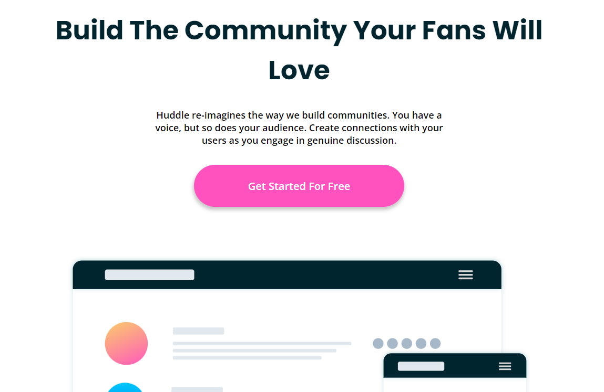

# Desafio landing page - frontendmentor 

> Desafio do Fontend Mentor

Projeto construído para praticar HTML e CSS responsivo.

[🔗 Clique aqui para acessar a página do desafio](https://www.frontendmentor.io/challenges/huddle-landing-page-with-curved-sections-5ca5ecd01e82137ec91a50f2)
[🔗 Clique aqui para acessar meu resultado](https://letescobar.github.io/Desafio2_FrontendMentor_landingPage/)

## 🛠 Tecnologias

-   HTML
-   CSS
-   Git e Github

## 💛 Contato

leticiaescobaraujo@gmail.com
